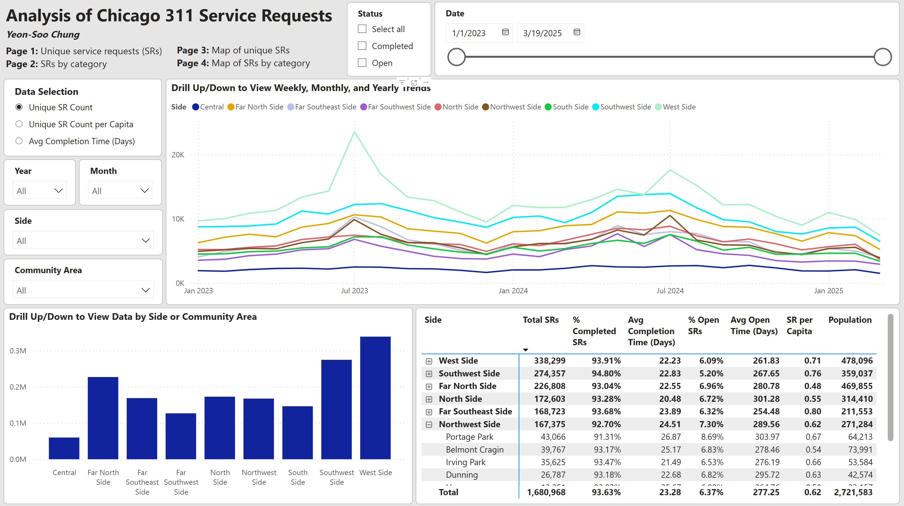

# Analysis of Chicago 311 Service Requests

The City of Chicago regularly collects and publishes many types of city-related data. Among them are 311 city service requests (SRs): https://data.cityofchicago.org/Service-Requests/311-Service-Requests/v6vf-nfxy/about_data

In this project, I was interested in analyzing this data to answer questions such as: what are some hidden trends that the city should consider investigating? What trends can help the city manage resources better? How are the different service request types and categories distributed across time and the city's community areas?

I developed an automated end-to-end ELT data pipeline to extract SR data since Jan. 1, 2023 via their API; store the data in Google Cloud Storage; load it to BigQuery for transformation with Python (Pandas); and then import the processed data to Power BI for visual analysis.

Complementary data tables that I created manually are (1). Table of Chicago's sides (e.g., North Side), community areas (e.g., Humboldt Park), and their respective 2022 populations; and (2). Table of categories, subcategories, and types that service requests can fall under, which I obtained directly from the city's SR portal and the extracted data itself.

To avoid posting any keys and credentials, I only uploaded the Python script for my Airflow DAG and data transformation; docker-compose yaml file; and the Dockerfile and requirements.txt files.

My interactive Power BI dashboard can be viewed here (data collected on Aug. 18, 2025): https://app.powerbi.com/view?r=eyJrIjoiNmY4NTAwNzAtNzQ2OC00NzEyLWIyOWQtOTNmMDIwNWQ5NTI0IiwidCI6ImJlMjI4MDdiLTI1OTEtNDBkNy1iYmI2LTBkYTg0ZDMxYWNmNyIsImMiOjN9

The pbix file can be downloaded here: https://drive.google.com/file/d/1TLANODb6EDqJ0TO7TDow9JXHI2jQKIif

I will make attempts to update this dashboard at least once a month. I plan to include data that includes two full years (Jan. 1 - Dec. 31) prior to updating as well as the current year up to the date my pipeline is executed.

Below is an image of the first page of my report.

The first page analyzes the unique SRs submitted. The second page contains SR data by category, sub-category, and type. Some service request types fall under multiple categories/sub-categories, so a separate page was created for this analysis.

## ELT Pipeline and Data Model

- **csr_dag.py:** This Python script creates the Airflow DAG, pictured below:
  - 

    
    

  - The executed tasks are
    - **latest_only:** My DAG is scheduled to run every week, but if there are any missed runs, this task ensures that the DAG is executed only once to get the most recent batch of data.
    - **download_data:** This task downloads SR data from the API provided by the City of Chicago to the Airflow Docker container.
    - **upload_to_gcs:** Uploads the SR data from the container to Google Cloud Storage bucket.
    - **load_gcs_to_bq_csr:** Loads the raw SR data from GCS bucket to BigQuery.
    - **load_bcs_to_bq_ca:** I manually created a table on the city's sides/community areas and uploaded it to my GCS bucket. This task loads this data table to BigQuery.
    - **load_gcs_to_bq_categories:** I manually created a table on available SR categories, subcategories, and types. This task loads this data table to BigQuery.
    - **run_bq_transform_sr_data:** This task runs the **transform_sr_data** function from the **csr_bq_transform_data.py** script (more on this script later) to process the raw SRs and categories data for visualization. It also creates the dates table.
    - **run_bq_transform_community_areas_data:** Runs the **community_areas** function from **csr_bq_transform_data.py**.
   
- **csr_bq_transform_data.py:** This script contains the following functions for preparing and transforming the data.
  - **transform_sr_data:** Below are some of the main transformations this function applies.
    - Remove "Aircraft Noise Complaint" SRs (~17% of all SRs).
    - Remove "311 INFORMATION ONLY CALL" SRs (~36% of all SRs).
    - Remove data that do not have latitude or longitude information (~0.05% of data).
    - Create new attribute 'Completion Time in Days' for SRs by taking the date difference between the created and completed dates for each SR.
    - Join the SRs data table with the categories data table.
    - There are some SRs that were completed extremely quickly. For example, multiple graffiti removal requests at the same location were completed in less than a day. I believe most of these are instances of multiple people reporting the same issue, so these repeated requests were quickly closed. To work around this, I grouped the SRs by Latitude, Longitude, Created Date, SR Category, SR Sub-Category, and SR Type. Then, for each grouping that contained completed SRs, I aggregated by the maximum "Completion Time in Days" along with its associated SR Number, Status ("Completed"), Street Address, and Area Number. For groupings that contained open SRs, "Completion Time in Days" is null, Status is "Open", and the rest of the attributes are the first available value.
    - Based on the completion times computed above, I created a new column "Closed Date" by adding "Completion Time in Days" to "Created Date". This column contains null values for open requests.
    - Created "Open SR Time in Days" for open SRs, which is the number of days between "Created Date" and date that this pipeline was executed.
  - **community_areas:** This formats the sides and community areas data table by title-casing the names and adding 2022 population data for each area.
  - **dates_table:** Creates table of dates that covers the range of the SR data, and adds columns such as month name, year, date of first day of week (Sunday), date of first day of month, etc.
 
- As of Mar. 19, 2025, the raw SR data since Jan. 1, 2023 contained 4,027,028 data points. The processed SRs data contained 2,277,208 rows.
- The processed dataset are shown in the PBI data model below:

## Summary of Findings

Below are some high-level general insights.

- There is a general trend where service requests are more common during the warmer months and dip during the winter months.
- Since Jan. 1, 2023, the West Side saw the most service requests, especially in the summer of 2023 in the Austin and West Town community areas. This was driven by service requests in the “Transportation and Street” and “Home and Buildings” categories.
- In terms of service requests per capita, the Far Southeast Side had the highest since Jan. 1, 2023. In terms of average completion time of a service request, the South Side had the longest.
- "Transportation and Streets" is the most common SR category in every Side, with its most common sub-category being "Potholes", "Vehicles/Bicycles/Scooters", "Street Lights", or "Traffic Lights and Signs" depending on the side.

Here are some more specific insights that the city could use to improve services.

- Although there was only a small increase in the number of service requests for “Commercial Fire Safety Inspection Request” from 2023 to 2024, the average completion time increased significantly from 5 days to 26 days, driven by sharp increases in Jul.-Sep. 2024. In 2023, the North Side had the highest average of 7 days. In 2024, Far Southeast and Far Southwest sides had the longest of 47 and 41 days, respectively. This may be worth investigating.
- “No Water Complaint” requests spiked in Jan. 2024 and Jan. 2025. In Jan. 2025, these were most common in the West Side. Across Chicago, the average completion time for this complaint decreased from 38 days in 2023 to 7 in 2024.
- “E-Scooter Parking” complaints have increased more than two-fold from 2023 to 2024, mostly driven by increases in the North Side. It maybe worthwhile to consider some sort of enforcement or resource management measures to decrease these complaints in the upcoming summer and fall.
  - Below is a line chart of this trend across the city (the legend only says "Transportation and Street", but this plot visualizes the trend for "E-Scooter Parking" complaints):
  - 

    
    

- There was a large spike in “Water Lead Test Visit Requests” made in Jan. 2025 (graph below). The Far Southeast Side and West Side made up most of these requests.
  - 

    
    
 
- Unsurprisingly, tree-related service requests were more common during the summer, but there were almost twice as many requests for “Tree Debris Clean-Up Request” and “Tree Emergency” in 2024 than in 2023, and the yearly average completion time across both request types increased from 5 days to 8 days.
  - Average completion times in 2024 were longest in the Southwest Side (average 11 days) and Far Southwest Side (also 11 days).
  - While the average completion time for "Tree Emergencies" decreased from 4 days in 2023 to 3 days in 2024 across the city,  “Tree Debris Clean-Up Requests” saw an increase from 5 days to 13 days (again, across the entire city).
  - The Southwest Side had the longest average completion time for “Tree Debris Clean-Up Requests” for both years while also seeing it increase from 8 days to 20.

